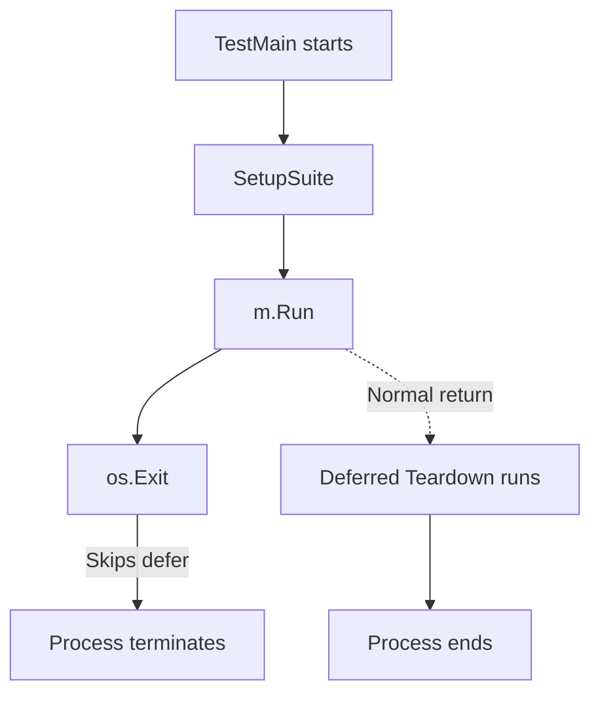

When writing integration tests in Go, it’s common to wrap setup and teardown
logic in `TestMain` to ensure resources are properly initialized and cleaned
up. But there’s a subtle trap when you mix this pattern with `os.Exit`—your
teardown code might never run.

## The Problem

Consider this `TestMain` implementation:

```go
func TestMain(m *testing.M) {
    globalSuite = &ProductTestSuite{}

    t := &testing.T{}
    if err := globalSuite.SetupSuite(t); err != nil {
        panic(err)
    }
    defer func() {
        if err := globalSuite.TeardownSuite(); err != nil {
            panic(err)
        }
    }()

    code := m.Run()
    os.Exit(code)
}
```

At first glance, it seems fine:
- We set up the global test suite.
- We `defer` a teardown to clean up after tests.
- We run the tests via `m.Run()`.
- We exit with the appropriate status code.

However, this implementation **silently skips the teardown**.

## Why Teardown Never Runs

In Go, `defer` statements run **only when a function returns normally or during panic stack unwinding**.
Calling `os.Exit()` short-circuits this mechanism—**it terminates the process immediately**, without running any deferred functions.

In this example:

1. `m.Run()` finishes and returns a code.
2. `os.Exit(code)` is called.
3. Process ends instantly — **the deferred `TeardownSuite()` never executes**.

When combined with `testcontainers-go`, this means containers never get stopped or removed. Over time, this led to:

- Dozens of dangling Docker containers.
- Port exhaustion.
- Disk space issues.
- CI jobs running out of resources.

### The Root Cause

`os.Exit()` is a low-level OS call. Once invoked, Go’s runtime can’t do anything else—not even run deferred cleanup code. This is a [documented behavior][1] and affects any Go program, not just tests. The diagram below illustrates the sequence of major steps of the test case execution.




The solid line shows the `os.Exit()` path where teardown is skipped.
The dashed line shows what happens with a normal return — teardown executes.

---

## The Fix

To keep `defer` semantics **and** exit with the right code, wrap the setup, test execution, and teardown logic in a helper function. This function can `defer` the teardown normally, and its return value can be passed to `os.Exit()` **after it returns**.

```go
func runTests(m *testing.M) int {
    globalSuite = &ProductTestSuite{}

    t := &testing.T{}
    if err := globalSuite.SetupSuite(t); err != nil {
        panic(err)
    }
    defer func() {
        if err := globalSuite.TeardownSuite(); err != nil {
            panic(err)
        }
    }()

    return m.Run()
}

func TestMain(m *testing.M) {
    code := runTests(m)
    os.Exit(code)
}
```

### Why This Works
- `runTests()` returns normally, so all `defer` calls inside it run before control goes back to `TestMain`.
- `os.Exit()` is called **after** cleanup is done, ensuring resources like Testcontainers are properly released.

{}
If you need cleanup in `TestMain`, never put it in a `defer` that lives in the same scope as `os.Exit()`. Put all test logic into a separate function, use `defer` there, and only call `os.Exit()` once that function returns.
{}


## References

1. Go by Example — Exit: *"defer statements are not run when using os.Exit"*
   https://gobyexample.com/exit

2. GoDoc — os.Exit: *"Exit causes the current program to exit with the given status code. Deferred functions are not run."*
   https://pkg.go.dev/os#Exit

3. Go Forum — Return from main with exit status and run deferred functions:
   https://forum.golangbridge.org/t/return-from-main-with-exit-status-and-run-deferred-functions/20841

4. Medium — Golang edge case when defer will never work out in your code:
   https://waclawthedev.medium.com/golang-edge-case-when-defer-will-never-work-out-in-your-code-f783518679e9

[1]: https://pkg.go.dev/os#Exit
