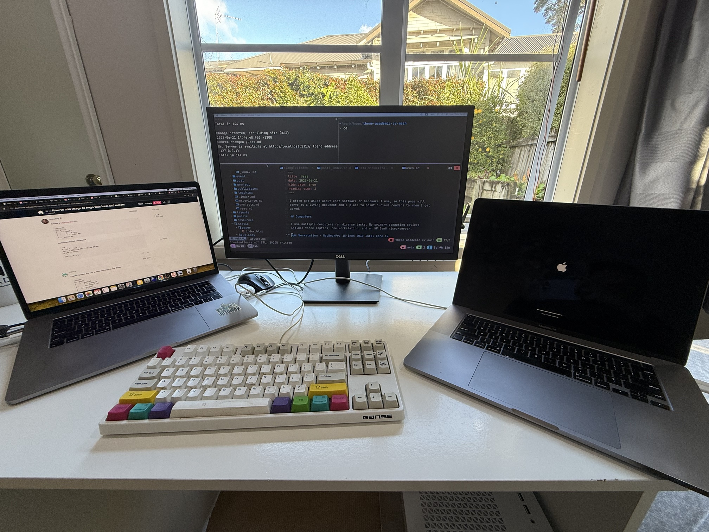
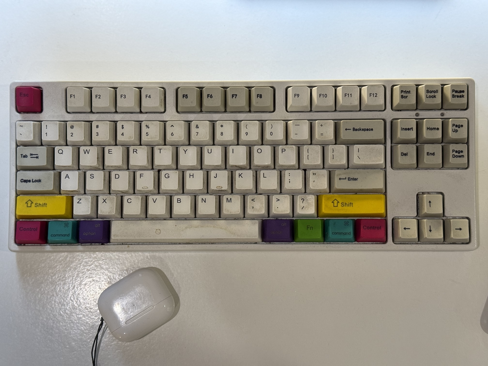
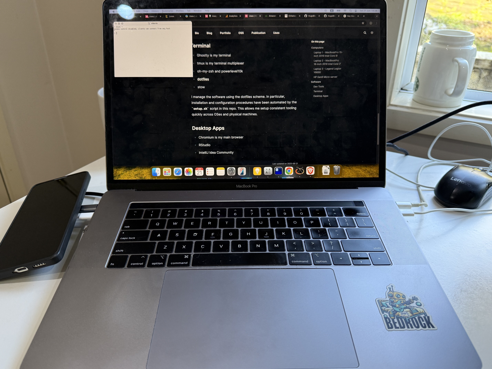
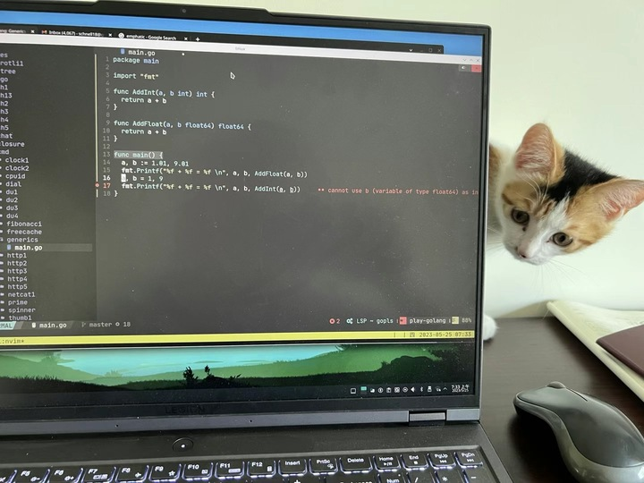
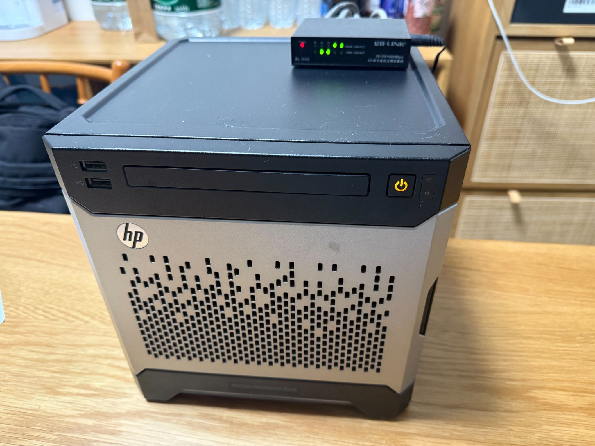

I often get asked about what software or hardware I use, so this page will
serve as a living document and a place to point curious readers to when I get
asked.

## Hardware

I use multiple computers for diverse tasks. My primary computing devices
include three laptops, one workstation, and an HP Gen8 micro-server.

### Keyboard

As a die-hard vimer and frugal consumer, I use this mechanical keyboard from a
less well-known brand. Believe me, the comfort of typing is almost identical to
other expensive brands.

### Workstation - DIY PC with nVidia RTX 4090

This is a DIY PC with a powerful nVidia GeForce RTX 4090 GPU, a spacious
server-grade RAM with a capacity of 192GiB, powerful Intel i9 14900KF CPU, two
HP FX900 Pro 2T SSDs, a 4T HDD. This workstation is good enough for serving
small to medium LLMs for generative AI workloads. It is a staging environment
to explore application requires significant computing demand before moving to
cloud.

### Laptop 1 - MacBookPro 15-inch 2019 Intel Core i9

This is second-hand MBP with decent Intel i9 CPU, spacious SSD (1T), and good
RAM capacity (32GiB), which is ideal for accommodating a few virtual machines
or containers. Overall, this MBP is solid although the built-in keyboard has no
physical escape key, which is annoying for die-hard vimmer.

### Laptop 2 - MacBookPro 16-inch 2019 Intel Core i7

This is another ultra-cheap second-hand MBP with bigger display and an improved
keyboard with longer key travel and physical escape key. Equipped with Intel i7
CPU, 16 GiB RAM, 512 GiB SSD, this MBP is good enough for coding and scientific
writing using LaTeX.

### Laptop 3 - Legend Legion Y9000

An entry-level gaming laptop with nVidia RTX 4060. This purpose of this laptop
is to provide bare-metal Windows and Linux environments to test software
requires such settings.

### HP Micro-server Gen8

This HP gen8 microserver is a solid, small cubic box equipped with 4 hard-drive
bays, 3 ethernet ports. It primarily serves as file storage.

## Software

I prefer open-source software for my day-to-day use.

### Terminal

- Ghostty is my terminal
- tmux is my terminal multiplexer
- oh-my-zsh and powerlevel10k
- [dotfiles][1]
- stow

I manage the software using the dotfiles scheme. In particular, installation
and configuration procedures have been automated by the `setup.sh` script in
this repo. This allows me setup consistent tooling quickly across OSes and
physical machines.

### Editor

My primary editor is neovim, though occasionally I also tinker with the
good-old vim. My neovim configuration approach follows dotvim scheme.
Additionally, the configurations are integrated with the aforementioned
dotfiles. Specifically, the [dotneovim][3] repository is a submodule of
dotfiles. This means I can replicate my neovim editing experience on a new
computer swiftly by simply executing:

~~~~bash
cd $HOME
git clone https://github.com/schnell18/dotfiles
cd ~/dotfiles
./setup.sh nvim
~~~~

I've tried diverse neovim themes and settled on [nvchad][4].
My favorite plugins include:

- stevearc/conform.nvim
- mfussenegger/nvim-lint
- neovim/nvim-lspconfig
- williamboman/mason-lspconfig.nvim
- schnell18/mason-nvim-lint
- williamboman/mason.nvim
- nvim-treesitter/nvim-treesitter
- lervag/vimtex
- let-def/texpresso.vim
- mfussenegger/nvim-dap
- leoluz/nvim-dap-go
- nvim-neotest/neotest
- CopilotC-Nvim/CopilotChat.nvim

These plugins offer terrific syntax highting, linting, code completion etc
across the major languages such as Python, Lua, Golang, bash and LaTeX.

### Desktop Apps

- Chromium is my main browser
- RStudio
- IntelliJ Idea Community

### General Dev Tools

Neovim, coupled with tmux, is my primary tool for virtually all tasks such as
development, presentation, and documentation.
- neovim is my main tool for programming, writing
- IDEs: IntelliJ Idea Community (Java), RStudio (R), JupyterLab
- podman, [localenv][2] for containerized applications
- Terraform, Ansible, AWS CLI
- Virtual Machine: lima, libvirt, packer

### Python Dev Tools

- neovim + pylsp
- JupyterLab
- pandas + matplotlib
- uv
- pdb

### Java Dev Tools

- IntelliJ Idea Community
- sdkman
- maven
- localenv

### Golang Dev Tools

- neovim + gopls + dlv
- gvm
- localenv
- podman
- lima

[1]: https://github.com/schnell18/dotfiles
[2]: https://github.com/schnell18/localenv
[3]: https://github.com/schnell18/dotneovim
[4]: https://github.com/schnell18/dotneovim/tree/nvchad
